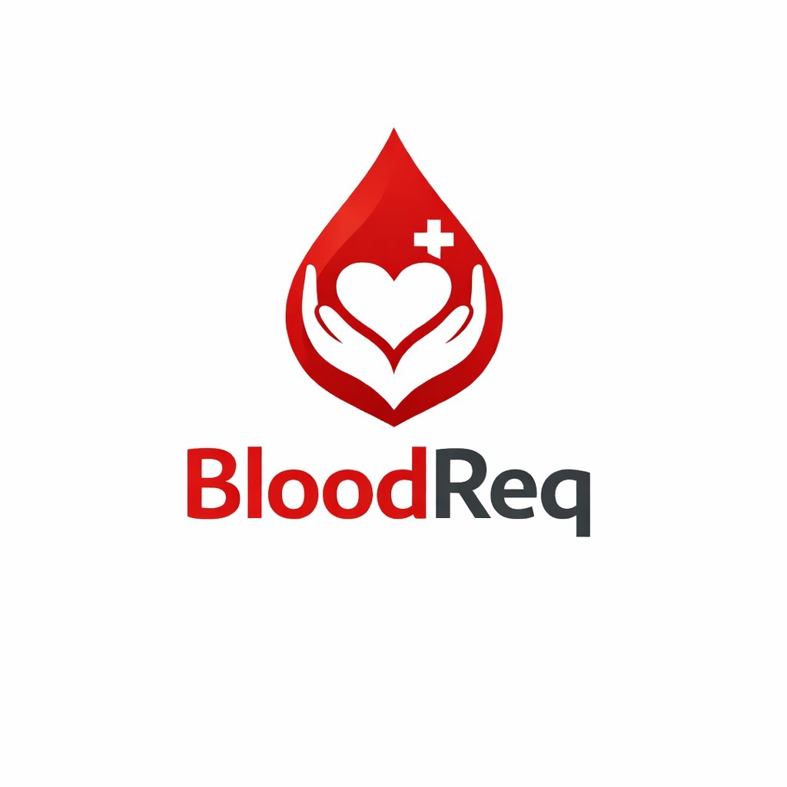

# BloodReq Mobile

<p align="center">
  
</p>

<p align="center">
  <strong>Blood Donation & Patient Assistance Mobile App</strong>
</p>

---

## 📱 Overview

BloodReq is a comprehensive Flutter mobile application designed to connect blood donors with patients in need. The app facilitates emergency blood requests, donor matching based on blood type and location, and includes features for fundraising medical campaigns.

### Key Features

- 🩸 **Blood Request Management** - Create, browse, and respond to blood donation requests
- 🔔 **Smart Notifications** - Real-time push notifications for nearby blood requests via OneSignal
- 📍 **Location-Based Matching** - Find donors/requests within your specified radius
- 💰 **Fundraiser Campaigns** - Create and donate to medical fundraising campaigns
- 🏆 **Donor Leaderboard** - Gamification with badges and rankings for active donors
- 🔐 **Secure Authentication** - Google OAuth + Email/Password via Firebase
- 🌍 **Multi-Language Support** - i18n ready with locale management
- 🌓 **Dark/Light Theme** - Full theme customization support
- 📊 **Donor Profile & Verification** - Complete donor profiles with medical verification

---

## 🛠 Tech Stack

| Category               | Technology                                         |
| ---------------------- | -------------------------------------------------- |
| **Framework**          | Flutter 3.10+ (Dart)                               |
| **State Management**   | Provider                                           |
| **Navigation**         | GoRouter                                           |
| **Authentication**     | Firebase Auth + Google Sign-In                     |
| **Push Notifications** | OneSignal                                          |
| **Local Storage**      | Hive + Shared Preferences + Flutter Secure Storage |
| **Location**           | Geolocator + Geocoding                             |
| **HTTP Client**        | http package                                       |
| **Animations**         | flutter_animate + Lottie                           |
| **Ads**                | Facebook Audience Network                          |
| **Forms**              | Flutter Form Builder                               |

---

## 📁 Project Structure

```
BloodReq-mobile/
├── android/                    # Android platform configuration
├── ios/                        # iOS platform configuration
├── assets/
│   ├── animations/             # Lottie animation files
│   ├── fonts/                  # Custom fonts
│   ├── icons/                  # App icons and UI icons
│   └── images/                 # Static images and splash screens
├── lib/
│   ├── main.dart               # App entry point and initialization
│   ├── core/                   # Core app infrastructure
│   │   ├── config/             # App configuration (themes, env)
│   │   ├── constants/          # API endpoints, app constants, theme config
│   │   ├── i18n/               # Internationalization and locales
│   │   ├── models/             # Shared data models
│   │   ├── providers/          # State providers (Auth, Theme, Language, Scroll)
│   │   ├── services/           # App services (API, Notifications, Ads, Sync)
│   │   ├── utils/              # Utility functions
│   │   └── widgets/            # Shared widgets
│   ├── features/               # Feature modules (Clean Architecture)
│   │   ├── auth/               # Authentication feature
│   │   │   ├── models/         # Auth-specific models
│   │   │   ├── screens/        # Login, Register, Onboarding, OTP, Forgot Password
│   │   │   └── widgets/        # Auth-specific widgets
│   │   ├── blood_requests/     # Blood request feature
│   │   │   ├── models/         # Request models
│   │   │   ├── screens/        # Request list, create, detail, my requests/donations
│   │   │   └── widgets/        # Request cards, forms
│   │   ├── fundraisers/        # Fundraising feature
│   │   │   ├── screens/        # Fundraiser list, detail, create
│   │   │   └── widgets/        # Campaign cards, donation forms
│   │   ├── home/               # Home feature
│   │   │   └── screens/        # Home screen, main shell (bottom nav)
│   │   ├── leaderboard/        # Donor leaderboard
│   │   │   └── screens/        # Leaderboard rankings
│   │   ├── notifications/      # Notifications feature
│   │   │   └── screens/        # Notification center
│   │   ├── profile/            # User profile feature
│   │   │   └── screens/        # Profile view, edit profile
│   │   ├── settings/           # App settings
│   │   │   └── screens/        # Settings screen
│   │   └── verification/       # Donor verification
│   │       └── screens/        # Verification process screen
│   └── shared/                 # Shared components
│       ├── models/             # Shared data models
│       ├── utils/              # Shared utility functions
│       └── widgets/            # Reusable UI components
└── test/                       # Unit and widget tests
```

---

## 📂 File Details

### Core Layer (`lib/core/`)

| Directory                                | Purpose                                                              |
| ---------------------------------------- | -------------------------------------------------------------------- |
| `config/`                                | App-wide configuration including theme setup and environment configs |
| `constants/app_constants.dart`           | API endpoints, storage keys, blood groups, badge tiers               |
| `constants/theme_config.dart`            | Light/Dark theme definitions and color palette                       |
| `i18n/`                                  | Localization files for multi-language support                        |
| `models/`                                | Base models used across features                                     |
| `providers/auth_provider.dart`           | Authentication state management                                      |
| `providers/theme_provider.dart`          | Theme switching (dark/light)                                         |
| `providers/language_provider.dart`       | Language/locale management                                           |
| `providers/scroll_control_provider.dart` | Scroll behavior management                                           |
| `services/api_service.dart`              | HTTP client with auth token handling                                 |
| `services/router_service.dart`           | GoRouter configuration and route definitions                         |
| `services/notification_service.dart`     | OneSignal push notification handling                                 |
| `services/ad_service.dart`               | Facebook Audience Network ads                                        |
| `services/cache_service.dart`            | Local data caching                                                   |
| `services/sync_service.dart`             | Background data synchronization                                      |
| `services/campaigns_service.dart`        | Campaign/fundraiser data fetching                                    |
| `services/verification_service.dart`     | Donor verification logic                                             |

### Features Layer (`lib/features/`)

| Feature            | Screens                                                                                                                                                    | Description                                              |
| ------------------ | ---------------------------------------------------------------------------------------------------------------------------------------------------------- | -------------------------------------------------------- |
| **auth**           | `splash_screen.dart`, `login_screen.dart`, `register_screen.dart`, `onboarding_screen.dart`, `forgot_password_screen.dart`, `otp_verification_screen.dart` | Complete auth flow with Google OAuth and email/password  |
| **blood_requests** | `blood_requests_screen.dart`, `create_request_screen.dart`, `request_detail_screen.dart`, `my_requests_screen.dart`, `my_donations_screen.dart`            | View all requests, create new requests, manage donations |
| **fundraisers**    | `fundraisers_screen.dart`, `fundraiser_detail_screen.dart`, `create_fundraiser_screen.dart`                                                                | Browse and create medical fundraising campaigns          |
| **home**           | `home_screen.dart`, `main_shell.dart`                                                                                                                      | Dashboard with bottom navigation shell                   |
| **leaderboard**    | `leaderboard_screen.dart`                                                                                                                                  | Top donors ranking with badges                           |
| **notifications**  | `notifications_screen.dart`                                                                                                                                | Push notification history                                |
| **profile**        | `profile_screen.dart`, `edit_profile_screen.dart`                                                                                                          | User profile management                                  |
| **settings**       | `settings_screen.dart`                                                                                                                                     | App preferences (theme, language, notifications)         |
| **verification**   | `verification_screen.dart`                                                                                                                                 | Donor verification for blood requests                    |

---

## 🚀 Getting Started

### Prerequisites

- Flutter SDK 3.10+
- Dart SDK 3.0+
- Android Studio / Xcode (for mobile builds)
- Firebase project configured

### Installation

1. **Clone the repository**

   ```bash
   git clone https://github.com/yourusername/BloodReq.git
   cd BloodReq/BloodReq-mobile
   ```

2. **Install dependencies**

   ```bash
   flutter pub get
   ```

3. **Configure Firebase**
   - Add `google-services.json` to `android/app/`
   - Add `GoogleService-Info.plist` to `ios/Runner/`

4. **Update API Base URL**

   Edit `lib/core/constants/app_constants.dart`:

   ```dart
   static const String baseUrl = 'https://your-api-domain.com/api';
   ```

5. **Generate app icons**

   ```bash
   dart run flutter_launcher_icons
   ```

6. **Generate splash screen**
   ```bash
   dart run flutter_native_splash:create
   ```

### Running the App

```bash
# Development
flutter run

# Build APK (Android)
flutter build apk --release

# Build IPA (iOS)
flutter build ios --release
```

---

## 📡 API Configuration

The app communicates with the BloodReq Admin backend via REST API. Configure the following in `app_constants.dart`:

| Config                    | Description                               |
| ------------------------- | ----------------------------------------- |
| `ApiConfig.baseUrl`       | Base URL of your Next.js admin API        |
| `OneSignalConfig.appId`   | OneSignal app ID for push notifications   |
| `GoogleMapsConfig.apiKey` | Google Maps API key for location features |

### API Endpoints Used

| Category           | Endpoints                                                                                              |
| ------------------ | ------------------------------------------------------------------------------------------------------ |
| **Auth**           | `/auth/signup`, `/auth/signin`, `/auth/oauth`, `/auth/verify-otp`, `/auth/forgot-password`             |
| **Profile**        | `/profile`, `/profile/location`, `/profile/avatar`, `/profile/availability`                            |
| **Blood Requests** | `/blood-requests`, `/blood-requests/:id`, `/blood-requests/:id/donate`, `/blood-requests/:id/complete` |
| **Donations**      | `/blood-donations`, `/blood-donations/:id/mark-donated`, `/blood-donations/:id/confirm`                |
| **Fundraisers**    | `/fundraisers`, `/fundraisers/:id`, `/fundraisers/:id/donate`                                          |
| **Locations**      | `/locations/countries`, `/locations/cities`, `/locations/areas`, `/locations/reverse-geocode`          |
| **Notifications**  | `/notifications`, `/notifications/preferences`, `/notifications/register`                              |
| **Leaderboard**    | `/leaderboard`                                                                                         |
| **Config**         | `/config`, `/ads/config`                                                                               |
| **Payments**       | `/payments/initiate`, `/payments/verify`                                                               |

---

## 🎨 Theming

The app supports both light and dark themes. Theme configuration is in:

- `lib/core/constants/theme_config.dart` - Theme definitions
- `lib/core/providers/theme_provider.dart` - Theme state management

### Color Palette

| Color      | Light Mode | Dark Mode | Usage            |
| ---------- | ---------- | --------- | ---------------- |
| Primary    | `#B91C1C`  | `#DC2626` | Blood red accent |
| Background | White      | Deep blue | App background   |
| Surface    | Light gray | Navy      | Cards and panels |

---

## 🔔 Push Notifications

OneSignal is used for real-time push notifications:

- Blood request alerts based on location and blood type
- Donation status updates
- Fundraiser campaign updates

Configuration in `lib/core/services/notification_service.dart`

---

## 📦 Dependencies

```yaml
# Core
flutter: sdk
provider: ^6.1.2
go_router: ^14.3.0

# Firebase
firebase_core: ^4.4.0
firebase_auth: ^6.1.4
google_sign_in: ^6.2.1

# UI
google_fonts: ^6.2.1
flutter_svg: ^2.0.10+1
cached_network_image: ^3.4.1
shimmer: ^3.0.0
flutter_animate: ^4.5.0
lottie: ^3.1.3

# Location
geolocator: ^13.0.2
geocoding: ^3.0.0

# Storage
shared_preferences: ^2.3.3
flutter_secure_storage: ^9.2.2
hive: ^2.2.3
hive_flutter: ^1.1.0

# Notifications
onesignal_flutter: ^5.2.7

# Forms
flutter_form_builder: ^10.2.0
form_builder_validators: ^11.1.0

# Utilities
intl: ^0.20.2
http: ^1.2.2
connectivity_plus: ^6.1.1
permission_handler: ^11.3.1

# Ads
facebook_audience_network: ^1.0.1
```

---

## 🧪 Testing

```bash
# Run all tests
flutter test

# Run with coverage
flutter test --coverage
```

---

## 📄 License

This project is proprietary. All rights reserved.

---

## 👥 Contributors

- **BloodReq Team** - Development and Design

---

<p align="center">Made with ❤️ to save lives</p>
